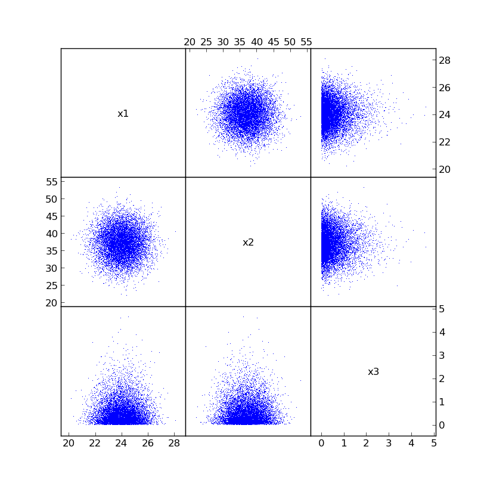
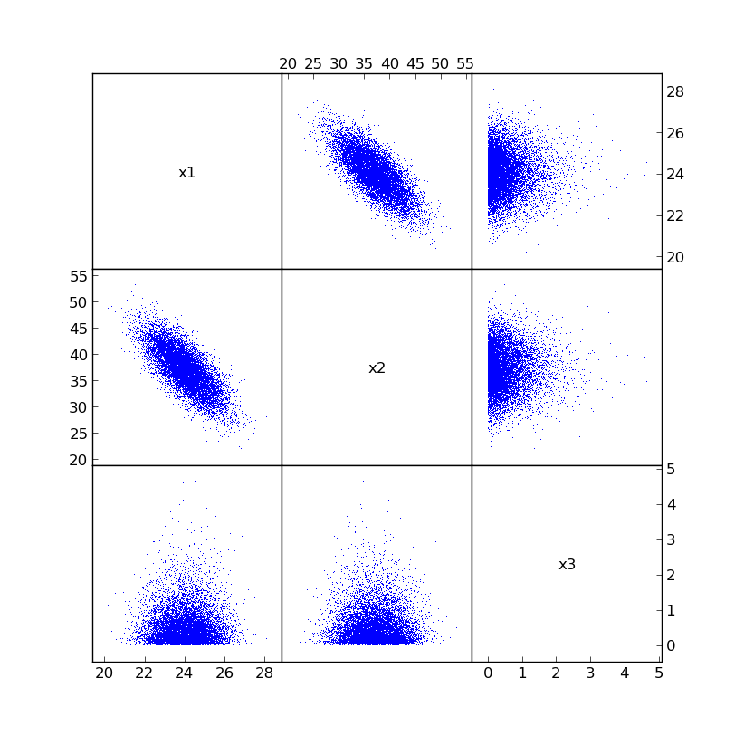

.. _correlations:

Correlations
------------

By default, the samples try to be as uncorrelated and independent as
possible from any other inputs. However, sometimes inputs to have some
degree of correlation between them. If it is desired to force a set of 
variables to have certain correlations, which is not uncommon in 
real-life situations, this can be done with the ``correlate`` function 
(NOTE: this should be done BEFORE any calculations have taken place in 
order to work properly).

For example, let's look at our original example with inputs ``x1``, ``x2``,
and ``x3``::

    # The correlation coefficients before adjusting
    >>> print correlation_matrix([x1, x2, x3])
    [[ 1.          0.00558381  0.01268168]
     [ 0.00558381  1.          0.00250815]
     [ 0.01268168  0.00250815  1.        ]]

You'll notice a few things about the correlation matrix. First, the 
diagonals are all 1.0 (they always are). Second, the matrix is symmetric.
Third, the correlation coefficients in the upper and lower triangular
parts are relatively small. This is how ``mcerp`` is designed. Here is 
what the actual samples looks like in a matrix plot form:

Now, let's say we desire to impose a -0.75 correlation between ``x1``
and ``x2``. Let's create the desired correlation matrix (note that all 
diagonal elements should be 1.0)::

    # The desired correlation coefficient matrix
    >>> c = np.array([[  1.0, -0.75, 0.0],
    ...               [-0.75,   1.0, 0.0],
    ...               [  0.0,   0.0, 1.0]])

Using the ``mcerp.correlate`` function, we can now apply the desired
correlation coefficients to our samples to try and force the inputs
to be correlated::
    
    # Apply the correlations into the samples (works in-place)
    >>> correlate([x1, x2, x3], c)
    
    # Show the new correlation coefficients
    >>> print correlation_matrix([x1, x2, x3])
    [[  1.00000000e+00  -7.50010477e-01   1.87057576e-03]
     [ -7.50010477e-01   1.00000000e+00   8.53061774e-04]
     [  1.87057576e-03   8.53061774e-04   1.00000000e+00]]
 
The correlation matrix is roughly what we expected within a few percent.
Even the other correlation coefficients are closer to zero than before. If 
any exceptions appear during this operation, it is likely because the
correlation matrix is either not **symmetric**, not **positive-definite**, 
or both.
    
The newly correlated samples will now look something like:

.. note: This correlation operation doesn't change any of the original sampled
   values, it simply re-organizes them in such a way that they closely
   match the desired correlations.

Now that the inputs' relations have been modified, let's check how 
the output of our stack-up has changed (sometimes the correlations won't
change the output much, but others can change a lot!)::

    # Z should now be a little different
    >>> Z = (x1*x2**2)/(15*(1.5 + x3))
    >>> Z.describe
    MCERP Uncertain Value:
     > Mean...................  1153.710442
     > Variance...............  97123.3417748
     > Skewness Coefficient...  0.211835225063
     > Kurtosis Coefficient...  2.87618465139
 
We can also see what adding that correlation did: reduced the mean,
reduced the variance, increased the skewness, increased the kurtosis.

