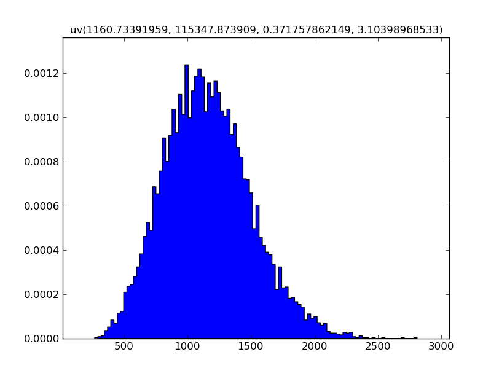

.. _viewing the distribution:

Viewing the distribution
------------------------

Any variable created using ``mcerp`` can be visualized using the ``plot``
class method, which has the following syntax::

    >>> x1.plot([hist=False], **kwargs)
    
At the main import (i.e., ``from mcerp import *``), we make available
the matplotlib.pyplot sub-module available through the object ``plt``,
which is required for later use since the ``plot`` function doesn't
automatically display the graph. Thus, we might have the following::

    >>> x1.plot()  # No inputs shows the distribution's actual PDF/PMF
    >>> plt.show()  # explicit 'show()' required to display to screen

.. image:: _static/x1.png
   :scale: 60%
   
As we can see, the default title is the information about the 
distribution object and the plot axes is scaled to fit well within the
plot window.

When plotting an object that is a result of prior calculations, since
a mathematical PDF/PMF may not be realizable, we resort to approximating
the distribution using a Kernel Density Estimate (KDE) of the data::

    >>> Z.plot()
    >>> plt.show()

.. image:: _static/Z_kde.png
   :scale: 60%

By using the ``hist=True`` keyword in the plot function, we an see a
histogram of the data instead of the KDE::

    >>> Z.plot(hist=True)  # shows a histogram instead of a KDE
    >>> plt.show()

Or since showing the plot is explicit, we can do both::

    >>> Z.plot()
    >>> Z.plot(hist=True)
    >>> plt.show()

.. image:: _static/Z_kde_hist.png
   :scale: 60%

Using Matplotlib's API, the plot can be customized to the full extent since
everything is done before the plot is displayed.